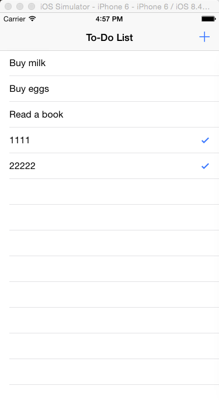

##ios 学习之路

> 欢迎转载，但请务必在明确位置注明出处！
> https://github.com/dungeonsnd/publicdoc/blob/master/published/4_2015_ios_learning/learn-ios-from-rookie.md
> 
> QQ交流群：入群理由请正确填写我的GitHub账号
>  * 58632494 (IOS学习之路1群）
>
>请不要重复加群，谢谢！

# 1 准备

1.1  学习背景

1.2  环境搭建
  硬件
  软件
  书籍、资料

# 2 入门
ios的学习基本上分为语言和UI两部分，因为对于转入做ios的开发者通常首先要学习OC(Objective-C)语言，其它是UI开发部分。

2.1 Objective-C 基本语法快速入门
http://tryobjectivec.codeschool.com/
课程分为五个部分(Level1 - level5)，每个部分又分为若干关卡。 每个关卡的学习过程中，读者先阅读页面左侧的文本讲解，然后完成网页中给出的任务(mission)，完成任务后才能进入下一关。

知识点讲解比较通俗易懂，适合有一点其它语言基础但没有接触过 OC的读者。 我花了大约6个小时完成了这五个部分。通常英文阅读和编程基础不错的话，6个小时左右应该能完成。如果你花了8个小时或者更多也没关系，重要是弄个每个关卡的主要知识点。

Level1 主要讨论了创建变量(NSString,NSNumber,NSArray,NSDictionary 类型)及如何格式化输出；
Level2 发送消息及获取结果, 字符串连接, alloc/init使用；
Level3 分支控制, NS_ENUM类型，NSArray及NSDictionary遍历, Blocks；
Level4 类，继承；
Level5 错误处理，NSCopying/copyWithZone ,  id类型。

2.2  官方文档的使用
学完2.1应该知道了常用的几种数据类型及其接受的消息，但是学完一遍不一定能记住。所以这时就应该学会查阅官方文档了，直接收藏，以后会经常用到。

2.3  UI开发的入门教程
这是苹果官方文档中的英文版的UI入门教程，适合初学者，大约需要n小时来学习，

[Start Developing iOS Apps Today](https://developer.apple.com/library/ios/referencelibrary/GettingStarted/RoadMapiOS/index.html#//apple_ref/doc/uid/TP40011343-CH2-SW1)

该文档讲解了如何完成一个简单的ToDoList的iphone app。
文档核心是 数据和展示 之间的交互方法。笔者简单总结如下，

a)   Create a Data Class 。  把ToDo列表中的一行描述成一个类，即ToDoItem

b)  Load the Data 。 在列表的ViewController中创建Array来存储列表数据，并在viewDidLoad函数中初始化。

c)  Display the Data。  依次修改下面的函数，numberOfSectionsInTableView:  Section数量，tableView:numberOfRowsInSection: 行数，cellForRowAtIndexPath:显示可视区域的每一行数据。

d) Toggle Item Completion State。 修改函数 didSelectRowAtIndexPath, 修改数据的完成状态，并使数据显示勾号。

e) Add New Items。AddToDoItemViewController添加属性，添加 text field和Save button  的事件关联，在Save Button的响应函数 prepareForSegue:中创建ToDoItem。在ToDoListTableViewController的unwindToList:中把新创建的ToDoItem加入到Array，并使列表刷新。

# 3 进阶

通常上一部分的学习可以算是基本入门了，但是IOS的很多知识还未涉及。那么进阶部分可以系统学习，同样分为语言和UI两部分。

语言部分推荐，书稍微早了一点，大约是13年的，但是幸好OC语言变化不大，
>  "Objective-C程序设计"       第6版，作者 S G K.
>  

# 4 关于我
